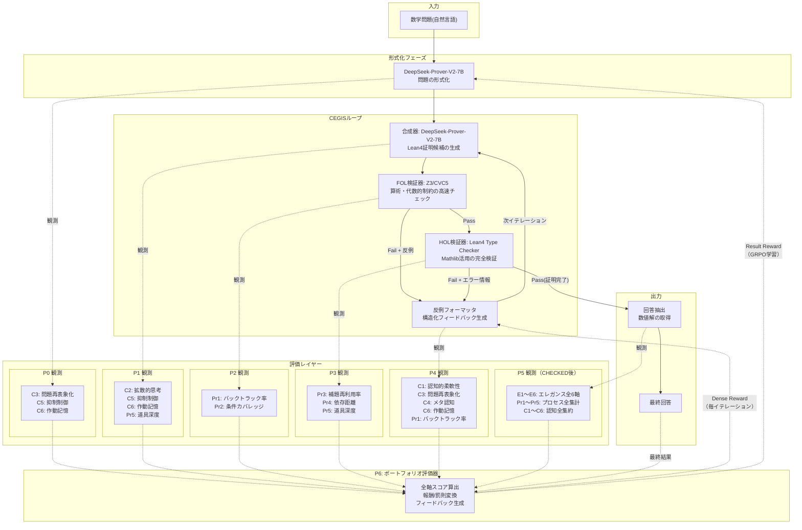

# CEGIS 構成 × エレガンス/認知能力 評価オーバーレイ

## 本文書の目的

CEGIS構成.mdの元図（ノード名・接続・subgraph構造）を一切変更せず、エレガンス/プロセス/認知能力の評価レイヤーを点線で外側から「かぶせる」形で注釈する。

---

## 第1部: どのプロセス・結果を、どの項目で評価するか

### 1-1. 評価項目の全体像（3層 × 17項目）

| 層 | # | 指標 | 何を測るか | 報酬方向 |
|:---:|:---:|------|-----------|:---:|
| エレガンス | E1 | 短さ | ステップ数・補助対象数・場合分け数の少なさ | ↑ |
| エレガンス | E2 | 局所性 | 各ステップが直前の少数ステップのみに依存する度合い | ↑ |
| エレガンス | E3 | 道具の軽さ | 使用定理の問題に対する相対的な重さ | ↑ |
| エレガンス | E4 | 本質性 | 問題の全条件を自然に使い切っている度合い | ↑ |
| エレガンス | E5 | 必然性 | 分岐が少なく一本筋に見える度合い | ↑ |
| エレガンス | E6 | 再利用性 | 1つの補題・アイデアが複数箇所で使われる度合い | ↑ |
| プロセス | Pr1 | バックトラック率 | CEGIS→P1の反復回数 / 全ステップ数 | ↓ |
| プロセス | Pr2 | 条件カバレッジ | FOL unsat coreで使われた前提の割合 | ↑ |
| プロセス | Pr3 | 補題再利用率 | HOL検証で採用された部品の再参照回数 | ↑ |
| プロセス | Pr4 | 依存距離 | 証明DAG上の平均ステップ間距離 | ↓ |
| プロセス | Pr5 | 道具深度 | 使用したMathlib定理の最大依存深度 | ↓ |
| 認知能力 | C1 | 認知的柔軟性 | 失敗後に異なる戦略へ切り替える能力 | ↑ |
| 認知能力 | C2 | 拡散的思考 | 多様な候補を生成する能力 | ⇅ |
| 認知能力 | C3 | 問題再表象化 | 問題自体を別の構造として捉え直す能力 | ↑ |
| 認知能力 | C4 | メタ認知 | 自己の推論過程を監視・評価する能力 | ↑ |
| 認知能力 | C5 | 抑制制御 | 不適切な自動反応（幻覚）を抑える能力 | ↓(違反時罰則) |
| 認知能力 | C6 | 作動記憶 | 複数の制約を同時に保持・操作する能力 | ↑ |

---

### 1-2. プロセス別：何を評価するか

#### 形式化フェーズ（DSFormalize = P0: 問題解釈・テンプレ選択）

**何を見るか**: LLMが問題を解釈し形式仕様に変換する時点での認知的振る舞い

| 評価項目 | 観測可能性 | 具体的に何を測定するか |
|---------|:---:|---------------------|
| C3 問題再表象化 | ○ | CEGIS→P0戻り時の前提集合差分。テンプレファミリーの変更回数 |
| C5 抑制制御 | ○ | 問題文にない前提（幻覚的仮定）を追加していないか |
| C6 作動記憶 | △ | 問題の全条件を形式仕様に落とし込めたか（条件の脱落有無） |
| C1 認知的柔軟性 | △ | CEGIS→P0再帰時にテンプレファミリーを変更したか |

**評価の理論的根拠**: P0はGf（流動性推理）の発露点。Dunckerの機能的固着克服のCEGIS版。

---

#### 合成器（Synthesizer = P1: Lean4証明候補の生成）

**何を見るか**: beam searchによる複数候補生成の質と多様性

| 評価項目 | 観測可能性 | 具体的に何を測定するか |
|---------|:---:|---------------------|
| C2 拡散的思考 | ○ | beam候補間の構造的距離（証明木の編集距離） |
| C5 抑制制御 | ○ | 生成候補に問題文にない前提が含まれるか |
| C6 作動記憶 | ○ | 生成候補が問題の全制約を反映しているか |
| Pr5 道具深度 | ○ | 候補が参照するMathlib定理の深度 |
| Pr4 依存距離 | △ | 候補の証明木構造からの推定（候補段階は不完全で精度低） |

**評価の理論的根拠**: Guilfordの拡散的思考（柔軟性次元）。二重過程理論のType 1固着の検出。

---

#### FOL検証器（FOLCheck = P2: Z3/CVC5）

**何を見るか**: 高速フィルタとして候補の質を反映する「鏡」

| 評価項目 | 観測可能性 | 具体的に何を測定するか |
|---------|:---:|---------------------|
| Pr2 条件カバレッジ | ○ | Z3のunsat coreが報告する前提使用情報 |
| Pr1 バックトラック率 | ○ | P2→P4（Fail）遷移の累積回数 |
| E4 本質性 | △ | unsat core分析による条件使用状況の予測 |

**評価の理論的根拠**: E4（本質性）のプロセス版。FOL段階の棄却率がP1の候補品質を反映。

---

#### HOL検証器（HOLCheck = P3: Lean4 Type Checker）

**何を見るか**: 精密な構造情報を返す完全検証器

| 評価項目 | 観測可能性 | 具体的に何を測定するか |
|---------|:---:|---------------------|
| Pr3 補題再利用率 | ○ | Lean4型チェック過程での補題参照回数 |
| Pr5 道具深度 | ○ | 使用されたMathlib定理の依存木の完全解析 |
| Pr4 依存距離 | ○ | Lean4証明木からの依存構造の完全抽出 |
| Pr2 条件カバレッジ | △ | sorry残存箇所の分析による条件脱落の検出 |

**評価の理論的根拠**: E2（局所性）、E3（道具の軽さ）、E6（再利用性）のプロセス版。

---

#### 反例フォーマッタ / CEGISエンジン（CEFormat = P4）

**何を見るか**: CEGISループの制御中枢での認知的意思決定

| 評価項目 | 観測可能性 | 具体的に何を測定するか |
|---------|:---:|---------------------|
| C1 認知的柔軟性 | ○ | 戦略変更の回数と有効性（次イテレーションでの進展有無） |
| C4 メタ認知 | ○ | P4経由の修正成功率 = 有効な修正 / 全エラー数 |
| C3 問題再表象化 | ○ | P4→P0の再帰発火（テンプレファミリーの根本変更）の検出 |
| C6 作動記憶 | ○ | イテレーション間で制約集合が一貫しているかの追跡 |
| Pr1 バックトラック率 | ○ | P4→P1遷移の累積回数 |
| E5 必然性 | △ | 探索木の分岐数をP4の遷移ログから間接推定 |

**評価の理論的根拠**: Miyakeの実行機能3コア（切り替え）の直接的な発現点。Flavellのメタ認知理論における「認知的制御」の操作的定義に最も近い場所。

---

#### 出力（Extract + Answer = P5: 最終チェッカ + 回答抽出）

**何を見るか**: 完成した証明の静的品質 + ループ全体の事後集計

| 評価項目 | 観測可能性 | 具体的に何を測定するか |
|---------|:---:|---------------------|
| E1 短さ | ○ | 完成証明のステップ数・補助対象数・場合分け数 |
| E2 局所性 | ○ | 完成証明木の依存DAGの平均依存距離 |
| E3 道具の軽さ | ○ | Mathlib定理の依存深度の最大値 |
| E4 本質性 | ○ | 問題の前提のうち証明で実際に使用された割合 |
| E5 必然性 | ○ | 最終証明の分岐数（不要な分岐を除いたもの） |
| E6 再利用性 | ○ | 完成証明内の補題の再利用率 |
| Pr1〜Pr5 | ○ | CEGISループの全履歴からプロセス指標を最終集計 |
| C1〜C6 | ○ | 全イテレーションの認知指標を集約 |

**評価の理論的根拠**: エレガンス6軸の**唯一の正式な評価点**。Kripkensteinの規則遵守論 ＝ 共同体の採点実践から抽出した代理指標を、完成した証明に対して適用する。

---

### 1-3. 結果別：何を評価するか

| 結果状態 | 評価可能な項目 | 評価の意味 |
|---------|-------------|----------|
| **成功（CHECKED）** | 全17項目（E1〜E6 + Pr1〜Pr5 + C1〜C6） | 正しい証明が存在するため全軸適用。正しさの上でエレガンスで順位付け |
| **予算切れ失敗** | 11項目（Pr1〜Pr5 + C1〜C6）。E1〜E6は不適用 | 失敗時こそ認知指標の診断価値が高い。「良い失敗」と「悪い失敗」を区別 |
| **毎イテレーション** | 6項目（C1, C4, C5, C6, Pr1, Pr2）のDense観測 | ループ内のミクロ報酬。P4 CEGISエンジンへの即時フィードバック |

---

### 1-4. フィードバックの方向

| フィードバック種別 | 対象 | 内容 | タイミング |
|----------------|------|------|----------|
| Dense Reward | P4 CEGISエンジン | C1,C4,C5,C6の微小報酬/罰則 | 毎イテレーション |
| Result Reward（成功時） | GRPO学習 | L_valid × (E1〜E6 + Pr1〜Pr5 + C1〜C6) | ループ完了時 |
| Result Reward（失敗時） | GRPO学習 | L_failure_diagnostic（Pr + C のみ） | ループ完了時 |
| プロンプト改善 | P0 問題解釈 | 弱点分析 + 改善ヒント | 次問題開始時 |
| パターンDB | Construction Memory | 成功/失敗パターンの蓄積 | ループ完了時 |

---

## 第2部: Mermaid図（元図の形を維持した評価オーバーレイ）

### 2-1. CEGIS構成図 + 評価オーバーレイ（主図）

元のCEGIS構成.mdの図（ノード名・ノードテキスト・接続・subgraph構造・分岐ラベル）を完全に保持し、評価の観測点・評価器・フィードバック経路を点線で外側からかぶせた図。

**読み方**:
- **実線** = CEGIS構成.mdの元フロー（ノード名・テキスト・接続を一切変更していない）
- **点線** = 評価の観測とフィードバック（本文書で追加した評価レイヤー）
- 各CEGISノードから点線で観測ノードに接続。観測ノードには「そこで何を測定するか」を記載
- P6ポートフォリオ評価器が全観測を集約し、2経路（Dense Reward → P4 / Result Reward → P0）でフィードバック

---

### 2-2. 交差マッピング要約表

P0〜P5 × 17指標の観測可能性:

| 指標＼プロセス | P0 形式化 | P1 合成器 | P2 FOL | P3 HOL | P4 反例フォーマッタ | P5 出力 |
|:---:|:---:|:---:|:---:|:---:|:---:|:---:|
| **E1 短さ** | × | × | × | × | × | ○ |
| **E2 局所性** | × | × | × | × | × | ○ |
| **E3 道具の軽さ** | × | × | × | × | × | ○ |
| **E4 本質性** | × | × | △ | × | × | ○ |
| **E5 必然性** | × | × | × | × | △ | ○ |
| **E6 再利用性** | × | × | × | × | × | ○ |
| **Pr1 バックトラック率** | × | × | ○ | × | ○ | ○ |
| **Pr2 条件カバレッジ** | × | × | ○ | △ | × | ○ |
| **Pr3 補題再利用率** | × | × | × | ○ | × | ○ |
| **Pr4 依存距離** | × | △ | × | ○ | × | ○ |
| **Pr5 道具深度** | × | ○ | × | ○ | × | ○ |
| **C1 認知的柔軟性** | △ | × | × | × | ○ | ○ |
| **C2 拡散的思考** | × | ○ | × | × | × | ○ |
| **C3 問題再表象化** | ○ | × | × | × | ○ | ○ |
| **C4 メタ認知** | × | × | △ | △ | ○ | ○ |
| **C5 抑制制御** | ○ | ○ | × | × | × | ○ |
| **C6 作動記憶** | △ | ○ | × | × | ○ | ○ |

凡例: ○ = 直接観測可能 / △ = 間接推定 / × = 観測不能

---

## 資料準拠/提案/未整備の区別

### 資料準拠（事実）
- エレガンス6指標（E1〜E6）の定義と近似方法（エレガンスの評価方法.md）
- 認知能力6指標（C1〜C6）の定義と心理学的根拠（仮説推論の評価方法.md）
- プロセス5指標（Pr1〜Pr5）の定義（CEGIS評価マッピング.md 第1部1-2節で定義済み）
- 損失関数の基本構造: `L = a*L_valid + b*L_rank + c*L_style + d*L_length_reg`
- 3層分離の原則: 正しさ → エレガンス → 説明品質
- CEGISのP0〜P5ポート構成（CEGIS構成.md）
- 報酬シグナル候補の7項目（仮説推論の評価方法.md IV節）
- ペア比較学習の根拠（エレガンスの評価方法.md）

### 提案/ドラフト
- 第1部: 各プロセスの評価項目テーブル（CEGIS評価マッピング.mdの要約・再構成）
- 第1部: 結果別の評価項目テーブル（CEGIS評価マッピング.md第3部の要約）
- 第1部: フィードバック方向テーブル
- 第2部: CEGIS元図に忠実な評価オーバーレイMermaid図（図面の構成は提案）

### 未整備
- 各プロセス指標の具体的閾値
- C2（拡散的思考）の最適レンジの数値
- ドメイン別（幾何 vs 整数論）の重み差
- 損失関数の各重みのチューニング方法
