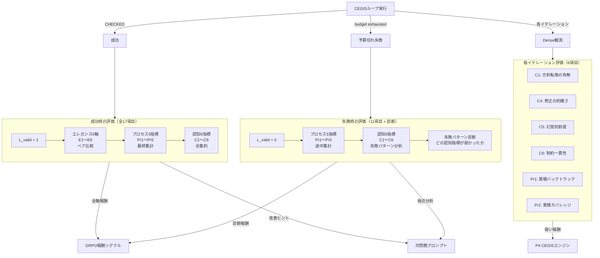
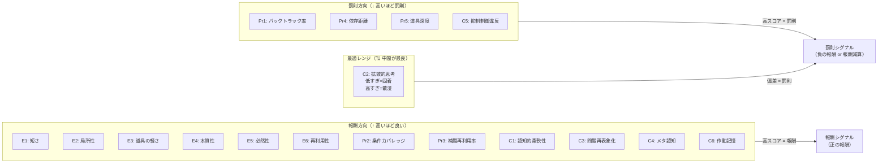
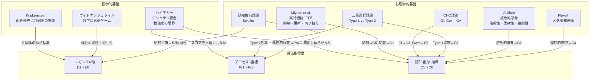

# CEGIS 評価マッピング: プロセス × 評価項目の理論的対応

## 本文書の位置づけ

| 既存文書 | 定義するもの |
|---------|-----------|
| CEGIS構成.md | P0〜P5の6ポート定義、ルール表、出力パターンと遷移 |
| CEGIS評価範囲図.md | 3層評価（エレガンス/プロセス/認知）の範囲とフィードバック先 |
| CEGIS評価統合アーキテクチャ.md | 観測レイヤー、損失関数、P6ポートフォリオ評価器 |
| **本文書** | **「なぜその評価項目がそのプロセスに対応するのか」の理論的根拠** |

上記3文書が「何を・どこで・どこへ」を定義しているのに対し、本文書は各対応関係の**妥当性の論証**を与える。

---

## 第1部: 17評価項目の理論的基盤

### 1-1. エレガンス6軸

**根拠の層**: 数学共同体の「良い証明」の暗黙知を形式化したもの。Kripkensteinの規則遵守論に基づき、「正しさ」が共同体の訂正実践に支えられるように、「エレガンス」もまた共同体がどう採点するかの実践に支えられる。個人の美的感覚ではなく、IMO採点・査読・教科書選択といった反復可能な実践から抽出された代理指標である。

| # | 指標 | 定義 | 理論的根拠 | 近似方法 |
|---|------|------|-----------|---------|
| E1 | **短さ (Length)** | ステップ数・補助対象数・場合分け数の少なさ | Kolmogorov複雑性の直観的近似。「最短記述長 ≈ 本質の捉え方」というアルゴリズム情報理論的根拠。ただし短さのみを追求すると「道具の重さ」が増す（高度な定理を使えば短くなる）ため、E3との緊張関係を持つ |  自動カウント |
| E2 | **局所性 (Locality)** | 各ステップが直前の少数ステップのみに依存する度合い | 認知負荷理論（Sweller）の内在的認知負荷に対応。依存距離が短いほど読み手の作動記憶負荷が低い。同時に、局所的な証明は「なぜそのステップが必要か」が自明になるため、証明の検証可能性（ヴィトゲンシュタイン的な公共性）が高まる | 推論DAGの平均依存距離 |
| E3 | **道具の軽さ (Tool minimality)** | 使用した定理・補題の問題に対する相対的な重さ | 「大砲で蚊を撃つ」問題の形式化。問題の本質的な難しさに比して過剰な道具を使うことは、証明が問題の構造を捉えていないことを示唆する。CHC理論のGf（流動性推理）の観点から、「適切な道具を選ぶ」能力は、既知の道具を全て投入する力とは区別される | Mathlib定理の依存深度 |
| E4 | **本質性 (Constraint usage)** | 問題の全条件を自然に使い切っている度合い | 数学的に条件が余る証明は、より弱い命題しか証明していない可能性を示唆する。逆に、条件を使い切る証明は問題の「tight」な構造を反映している。これは仮説推論における「制約充足」と同構造であり、CHC理論のGwm（作業記憶）が全制約を同時に保持する能力に対応する | 条件使用カバレッジ + 使用タイミング |
| E5 | **必然性 (Inevitability)** | 分岐が少なく一本筋に見える度合い | 必然性の高い証明は「他のやり方がない」という感覚を与える。これはメタ認知的に「この方針が唯一の道だ」と確信できる状態に対応する。探索木の分岐数が少ないことは、Type 2推論（熟慮的）が効率的に収束したことの指標でもある | 最終証明の分岐数・バックトラック量 |
| E6 | **再利用性 (Conceptual compression)** | 1つの補題・アイデアが複数箇所で使われる度合い | 「概念圧縮」＝ 少数の中心的アイデアで多くを説明できること。これは拡散的思考（Guilford）の「精緻性（elaboration）」の逆操作であり、収束的思考の品質指標。認知科学でいう「チャンキング」（Miller, 1956）の証明版 | 補題再利用率 |

**エレガンス6軸間の緊張関係（資料準拠）**:
- E1（短さ）↔ E3（道具の軽さ）: 高度な定理を使えば短くなるが、道具が重くなる
- E2（局所性）↔ E6（再利用性）: 補題を再利用すると非局所的な依存が生じる
- E5（必然性）↔ E4（本質性）: 全条件を使い切ろうとすると分岐が増えることがある

これらの緊張関係があるため、6軸を単純加算ではなくペア比較（ランキング学習）で扱うのが資料の一貫した主張である。

---

### 1-2. プロセス5指標

**根拠の層**: 探索効率の代理指標。二重過程理論のType 2（熟慮的推論）がCEGISループ内でどれだけ効率的に機能したかを測定する。エレガンスが「完成した証明の静的品質」を評価するのに対し、プロセス指標は「証明にたどり着く過程の動的効率」を評価する。

| # | 指標 | 定義 | 理論的根拠 | 近似方法 |
|---|------|------|-----------|---------|
| Pr1 | **バックトラック率** | CEGIS→P1の反復回数 / 全ステップ数 | 認知心理学の問題解決研究（Newell & Simon, 1972）における「手戻り」の頻度。バックトラックが少ないほど、初期の方針立案が適切だったことを示す。ただし、バックトラック率ゼロは「反省なし」を意味しうるため、「適度な低さ」が望ましい | P4→P1遷移の回数 / 全遷移数 |
| Pr2 | **条件カバレッジ** | FOL unsat coreで使われた前提の割合 | 問題の条件（前提）を実際にどれだけ活用したか。条件カバレッジが低い場合、証明が問題の一部しか扱っていないか、条件を見落としている。E4（本質性）のプロセス版 | Z3 unsat core / 全前提数 |
| Pr3 | **補題再利用率** | HOL検証で採用された部品の再参照回数 | 「使い回し」の頻度が高いほど、見出した構造が汎用的だったことを示す。E6（再利用性）のプロセス版だが、成功した証明だけでなく失敗した試行からの部品回収も含む | 採用部品の参照回数 |
| Pr4 | **依存距離** | 証明DAG上の平均ステップ間距離 | E2（局所性）のプロセス版。探索過程全体を通じた依存構造の複雑さを測る。認知負荷理論の「外在的認知負荷」に対応し、距離が長いほど探索が「絡まっている」 | DAGの平均エッジ長 |
| Pr5 | **道具深度** | 使用したMathlib定理の最大依存深度 | E3（道具の軽さ）のプロセス版。探索過程で「どこまで深い定理に手を伸ばしたか」を測る。浅い道具で解決できた場合、問題の本質を早期に見抜いたことを示唆する | Mathlib依存木の最大深度 |

**プロセス指標とエレガンス指標の関係**: プロセス指標は「探索全体の振る舞い」、エレガンス指標は「最終成果物の品質」を測る。同じ根底の性質（局所性、道具の軽さ、再利用性など）が、動的/静的の2つの顔で現れている。

---

### 1-3. 認知能力6指標

**根拠の層**: CHC理論（Cattell-Horn-Carroll）の広い認知能力モデルと、実行機能の3コアモデル（Miyake et al., 2000）に基づく。LLMの「理解」を内面で神秘化せず（Kripkenstein）、観測可能な振る舞いパターンとして定義する。

| # | 指標 | 定義 | 心理学的根拠 | CEGISでの操作的定義 |
|---|------|------|------------|-------------------|
| C1 | **認知的柔軟性 (Shifting)** | 失敗後に異なる戦略へ切り替える能力 | 実行機能3コアの「切り替え」（Miyake et al., 2000）。Wisconsin Card Sorting Testで測定される能力に対応 | P4での戦略/テンプレ変更のうち、次イテレーションで進展をもたらした割合 |
| C2 | **拡散的思考 (Divergent)** | 多様な候補を生成する能力 | Guilfordの拡散的思考モデル（流暢性・柔軟性・独創性・精緻性）。特に「柔軟性」＝構造的に異なるカテゴリの解法を出す力 | P1でのbeam候補間の構造的距離（証明木の編集距離） |
| C3 | **問題再表象化 (Reframing)** | 問題自体を別の構造として捉え直す能力 | Gf（流動性推理）の高次操作。Duncker（1945）の機能的固着の克服に対応。サイズ依存が最も高い能力の一つ（70B〜100B+で出現） | CEGIS→P0への戻り時の前提集合の変化量。テンプレファミリーの変更回数 |
| C4 | **メタ認知 (Metacognition)** | 自己の推論過程を監視・評価する能力 | Flavell（1979）のメタ認知理論。「自分の戦略が保証になっているか」の監視と方針転換の制御 | P4経由の自己修正成功率 = 有効な修正回数 / 全エラー数 |
| C5 | **抑制制御 (Inhibitory)** | 不適切な自動反応を抑える能力 | 実行機能3コアの「抑制」。二重過程理論のType 1（直感的）反応を抑え、Type 2（熟慮的）に切り替える力。LLMでは「初期スキーマへのロックイン」の抑制に対応 | P1で問題文にない前提を追加しなかった度合い。幻覚的な補助仮定の不在率 |
| C6 | **作動記憶 (Working Memory)** | 複数の制約を同時に保持・操作する能力 | CHC理論のGwm。スケーリングの鍵となる能力 ＝「同時に満たせる制約数」。パラメータ数N ↑ → effective rank ↑ → 並行保持可能な制約数 ↑ | 推論後半で前半の制約を忘れていない度合い。全イテレーションを通じた制約集合の一貫性 |

**認知能力指標間の階層関係（資料準拠）**:

```
サイズ依存: 低 ─────────────────────────────────── 高
             C5(抑制)  C6(WM)  C2(拡散)  C1(柔軟性)  C4(メタ)  C3(再表象)
同時制約数:   低        中      中        中〜高       高        中(単発)
```

C5（抑制制御）はプロンプト/手順で比較的誘発しやすい（サイズ依存低）のに対し、C3（問題再表象化）とC4（メタ認知）はサイズ依存が高く、外部ツール（CEGIS自体）やRLで強化する必要がある。

---

## 第2部: プロセス × 評価項目の交差マッピング

### 2-1. 交差マッピング表

以下の表で、CEGISの各プロセス（P0〜P5）と17評価項目の交差を3軸（観測可能性・理論的根拠・報酬方向）で記述する。

凡例:
- **観測**: ○ = 直接観測可能 / △ = 間接的に推定可能 / × = 観測不能
- **報酬方向**: ↑ = 高いほど報酬 / ↓ = 高いほど罰則 / ⇅ = 最適レンジがある

---

#### P0: 問題解釈・テンプレ選択

P0はDeepSeek-Prover-V2がLLMとして問題を解釈し、形式仕様に変換するフェーズ。CEGISループの「外」に位置するが、CEGIS→P0の再帰が発生する場合がある。

| 指標 | 観測 | 理論的根拠 | 報酬方向 |
|------|------|-----------|---------|
| C3 問題再表象化 | ○ | CEGIS→P0戻り時の前提集合差分が直接観測可能。Gf（流動性推理）の「構造転移」能力の発露点。Duncker（1945）の機能的固着克服のCEGIS版であり、P0が「同じ問題を別の目で見る」ことに成功したかを測る | ↑ |
| C5 抑制制御 | ○ | P0段階での問題解釈が、問題文にない前提（幻覚的仮定）を追加していないかを検出可能。二重過程理論のType 1抑制。LLMの「パターンマッチングによる過剰な仮定追加」はここで最も顕在化する | ↓ (違反時に罰則) |
| C6 作動記憶 | △ | P0が問題の全条件を形式仕様に落とし込めたかで間接推定。条件の脱落は作動記憶の容量限界を示唆する。ただしP0単体では「忘却」と「意図的な省略」の区別が困難 | ↑ |
| C1 認知的柔軟性 | △ | CEGIS→P0の再帰時にテンプレファミリーを変更したかで推定。ただしP0単体では「初回選択の質」しか見えず、柔軟性は再帰時にのみ観測可能 | ↑ |
| E1〜E6 全エレガンス | × | P0は証明を生成していないため、エレガンスの直接評価は不可能 | — |
| Pr1〜Pr5 全プロセス | × | ループ開始前のためプロセス指標は未定義 | — |

---

#### P1: 合成器（Lean4証明候補の生成）

P1はDeepSeek-Prover-V2がLean4証明候補を生成するフェーズ。beam searchで複数候補を同時生成する。

| 指標 | 観測 | 理論的根拠 | 報酬方向 |
|------|------|-----------|---------|
| C2 拡散的思考 | ○ | beam候補間の構造的距離を直接計算可能。Guilfordの拡散的思考の「柔軟性」次元に対応。構造的に類似した候補ばかり生成する（低多様性）のはType 1的な固着を示し、極端に異なる候補ばかり（高多様性すぎ）は収束的思考の弱さを示す | ⇅ (最適レンジ) |
| C5 抑制制御 | ○ | 生成された候補に問題文にない前提が含まれるかを検出可能。P0での抑制失敗がP1の出力に伝播する場合と、P1自体が幻覚的補題を導入する場合を区別可能 | ↓ (違反時に罰則) |
| C6 作動記憶 | ○ | 生成候補が問題の全制約を反映しているかで直接判定。候補間で制約の欠落パターンが異なる場合、WM容量の揺らぎを示唆する | ↑ |
| Pr4 依存距離 | △ | 候補の証明木構造から依存距離を推定可能だが、候補段階では不完全な証明が多く、測定精度が低い | ↑ (低いほど良い) |
| Pr5 道具深度 | ○ | 候補が参照するMathlib定理の深度を直接計測可能。初手から深い定理に手を伸ばすか、浅い道具から始めるかの戦略差が見える | ↑ (浅いほど良い) |
| E1〜E6 全エレガンス | × | 候補段階であり、検証済みの完成証明ではないため不適用 | — |

---

#### P2: FOL検証器（Z3/cvc5）

P2は証明候補の算術・代数的制約を高速チェックするフィルタ。LLMの認知能力ではなく、候補の質を反映する「鏡」として機能する。

| 指標 | 観測 | 理論的根拠 | 報酬方向 |
|------|------|-----------|---------|
| Pr2 条件カバレッジ | ○ | Z3のunsat coreが直接報告する前提使用情報がそのまま使える。E4（本質性）のプロセス版であり、P1が生成した候補が問題のどの条件を実際に使ったかの客観的指標 | ↑ |
| Pr1 バックトラック率 | ○ | P2→P4（Fail）の遷移回数が直接カウント可能。FOL段階での棄却率が高いほど、P1の候補品質が低いことを反映する | ↑ (低いほど良い) |
| C4 メタ認知 | △ | P2の反例がP4を経由してP1に戻る際、LLMがその反例をどう解釈したかで間接推定。P2自体はソルバーであり認知主体ではないが、P2の出力がLLMのメタ認知プロセスを駆動する | — (P2自体は評価対象外) |
| E4 本質性 | △ | unsat core分析により、完成した証明に近い候補がどの条件を「使い切った」かを予測可能。ただし正式な評価はP5でのみ行う | ↑ |

---

#### P3: HOL検証器（Lean4 Type Checker）

P3は完全な形式検証を行う。P2と同様にLLMの認知能力の「鏡」だが、より精密な構造情報を返す。

| 指標 | 観測 | 理論的根拠 | 報酬方向 |
|------|------|-----------|---------|
| Pr3 補題再利用率 | ○ | Lean4の型チェック過程で、どの補題が何回参照されたかを直接追跡可能。E6（再利用性）のプロセス版 | ↑ |
| Pr5 道具深度 | ○ | 使用されたMathlib定理の依存木を完全に解析可能。P3はP2より正確な道具深度を報告できる | ↑ (浅いほど良い) |
| Pr4 依存距離 | ○ | Lean4の証明木から依存構造を完全に抽出可能。候補段階（P1）より高精度 | ↑ (短いほど良い) |
| Pr2 条件カバレッジ | △ | HOLエラーメッセージから、使われなかった前提を推定可能。P2のunsat coreほど直接的ではないが、sorry残存箇所の分析で条件脱落を検出可能 | ↑ |
| C4 メタ認知 | △ | P3のエラー情報がP4経由でP1に戻る際のLLM反応で間接推定。P2と同様、P3自体は評価対象外だが、P3が提供する精密なエラー情報がメタ認知を駆動する | — |

---

#### P4: CEGISエンジン（テンプレ・文法・反例反映）

P4はCEGISループの制御中枢。P2/P3の反例・エラー情報を受けて、次イテレーションの戦略を決定する。認知能力の最も重要な発現点。

| 指標 | 観測 | 理論的根拠 | 報酬方向 |
|------|------|-----------|---------|
| C1 認知的柔軟性 | ○ | P4でのルール発火履歴から、戦略変更・テンプレ変更の回数と有効性を直接追跡可能。Miyakeの「切り替え」に直接対応する場面であり、Wisconsin Card Sorting Testの「ルール変更後の正答率」のCEGIS版。有効な方針転換 = 次イテレーションでP2/P3のstageが進展した場合 | ↑ |
| C4 メタ認知 | ○ | P4経由の修正成功率（= P4が提示した修正が次イテレーションで検証を通過した割合）が直接計算可能。Flavellのメタ認知理論における「認知的制御」の操作的定義に最も近い。自己修正が機能するとは、「エラーの原因を正しく同定し、適切な修正を施すこと」 | ↑ |
| C3 問題再表象化 | ○ | P4→P0の再帰発火（テンプレファミリーの根本変更）を直接検出可能。通常のP4→P1の修正とは質的に異なり、「問題の見方自体を変える」操作。発火頻度は低いが、発火時の効果が大きい場合に高スコア | ↑ |
| C6 作動記憶 | ○ | イテレーション間で制約集合が一貫しているかを追跡可能。P4が反例を受けて修正する際、以前のイテレーションで確認した制約を「忘れて」矛盾する修正を出すパターンはWM容量の限界を示す | ↑ |
| Pr1 バックトラック率 | ○ | P4の存在そのものがバックトラック。P4→P1遷移の累積回数がバックトラック率の分子を構成する | ↑ (低いほど良い) |
| E5 必然性 | △ | 探索木の分岐数をP4の遷移ログから間接推定可能。ただし正式な必然性評価はP5での完成証明に対して行う | ↑ |

---

#### P5: 最終チェッカ（Lean4独立検証） + 完成証明の静的分析

P5はCHECKED後の事後評価フェーズ。エレガンス6軸の**唯一の正式な評価点**。

| 指標 | 観測 | 理論的根拠 | 報酬方向 |
|------|------|-----------|---------|
| E1 短さ | ○ | 完成証明のステップ数・補助対象数・場合分け数を直接カウント。Kolmogorov複雑性の近似として、同一問題の複数証明間で比較する。単一証明の絶対ステップ数は問題難易度に依存するため、相対比較（ペア比較）が必須 | ↑ (短いほど良い) |
| E2 局所性 | ○ | 完成証明木の依存DAGを構築し、平均依存距離を計算。認知負荷理論における「読み手が同時に保持すべき前提の数」の代理指標 | ↑ (短いほど良い) |
| E3 道具の軽さ | ○ | 使用されたMathlib定理の依存深度の最大値。「問題の本質的難しさ」に対して道具が適切かの判定は、同一問題の別証明との比較で行う。軽い道具で証明できた場合、問題の構造をより深く理解していたことを示唆 | ↑ (浅いほど良い) |
| E4 本質性 | ○ | 問題の条件（前提）のうち、証明で実際に使用された割合。条件使用カバレッジ100%が理想だが、問題によっては一部条件が冗長な場合もあるため、「使用タイミング」（条件が証明の要所で使われたか）も考慮する | ↑ |
| E5 必然性 | ○ | 完成証明に至るまでの最終的な探索木の分岐数（不要な分岐を除いたもの）。バックトラック量が少なく一本筋に見えるほど、「この証明以外にありえない」感覚を与える。ただしP4の全バックトラック履歴ではなく、最終証明に残った分岐構造のみを評価する | ↑ (少ないほど良い) |
| E6 再利用性 | ○ | 完成証明内の補題の再利用率。同一補題が証明の異なる箇所で参照されている回数。「概念圧縮」の度合いであり、中心的アイデアの汎用性を示す | ↑ |

**P5で全プロセス・認知指標も最終集計する**:

| 指標 | 観測 | 備考 |
|------|------|------|
| Pr1〜Pr5 全プロセス | ○ | CEGISループの全履歴からプロセス指標を最終集計。P5到達はループ完了を意味するため、全データが揃う |
| C1〜C6 全認知 | ○ | 全イテレーションの認知指標を集約。成功に至った場合のみ、認知指標とエレガンス指標の相関分析が可能 |

---

### 2-2. 交差マッピング要約表

P0〜P5 × 17指標の観測可能性をまとめた一覧:

| 指標＼プロセス | P0 | P1 | P2 | P3 | P4 | P5 |
|:---:|:---:|:---:|:---:|:---:|:---:|:---:|
| **E1 短さ** | × | × | × | × | × | ○ |
| **E2 局所性** | × | × | × | × | × | ○ |
| **E3 道具の軽さ** | × | × | × | × | × | ○ |
| **E4 本質性** | × | × | △ | × | × | ○ |
| **E5 必然性** | × | × | × | × | △ | ○ |
| **E6 再利用性** | × | × | × | × | × | ○ |
| **Pr1 バックトラック率** | × | × | ○ | × | ○ | ○ |
| **Pr2 条件カバレッジ** | × | × | ○ | △ | × | ○ |
| **Pr3 補題再利用率** | × | × | × | ○ | × | ○ |
| **Pr4 依存距離** | × | △ | × | ○ | × | ○ |
| **Pr5 道具深度** | × | ○ | × | ○ | × | ○ |
| **C1 認知的柔軟性** | △ | × | × | × | ○ | ○ |
| **C2 拡散的思考** | × | ○ | × | × | × | ○ |
| **C3 問題再表象化** | ○ | × | × | × | ○ | ○ |
| **C4 メタ認知** | × | × | △ | △ | ○ | ○ |
| **C5 抑制制御** | ○ | ○ | × | × | × | ○ |
| **C6 作動記憶** | △ | ○ | × | × | ○ | ○ |

**読み方**: ○の箇所が「そのプロセスでその指標を直接計算する場所」であり、P6（ポートフォリオ評価器）が収集・統合する観測ポイントとなる。

---

## 第3部: 結果状態別の評価ポリシー

CEGISの実行結果は3つの状態に分かれ、評価可能な項目と評価の意味が異なる。

### 3-1. 成功（P5: CHECKED）

**評価可能範囲**: 全17項目

**評価の性質**: 成功時は「正しい証明」が存在するため、エレガンス6軸を含む全ての評価が適用可能。正しさ(Validity)が保証された上で、「どの程度良い証明か」を多軸で判定する。

**フィードバック先**:
- **GRPO学習の報酬シグナル**: L_valid(=1) + L_rank(エレガンス) + L_process + L_cognitive の全項を使用
- **プロンプト改善**: エレガンス・プロセスのスコアが低い軸について具体的な改善ヒントを生成
- **パターンDB**: 成功パターン（証明骨格 + テンプレ + エレガンススコア）を蓄積

**評価の優先順序（資料準拠: 3層分離原則）**:
1. 正しさ（自動判定、バイナリ）
2. エレガンス6軸（ペア比較で相対順位）
3. プロセス5指標（絶対値 + 問題難易度正規化）
4. 認知6指標（ループ全体の振る舞い分析）

---

### 3-2. 予算切れ失敗

**評価可能範囲**: プロセス5指標 + 認知6指標 = 11項目（エレガンス6軸は不適用）

**評価の性質**: 証明が完成しなかったため、「完成証明の静的品質」であるエレガンスは評価できない。しかし、**探索過程の品質と認知的振る舞いは評価可能であり、むしろ失敗時こそ認知指標の診断価値が高い**。

**失敗パターン分析（追加項目）**:

| 失敗パターン | 対応する認知指標の弱さ | 診断的示唆 |
|------------|---------------------|----------|
| 同一戦略でのループ暴走 | C1 認知的柔軟性の不足 | テンプレ変更閾値の引き下げが必要 |
| 候補の構造的均一性 | C2 拡散的思考の不足 | beam diversityの強化が必要 |
| 後半での制約矛盾 | C6 作動記憶の容量限界 | 外部メモリ/制約チェッカの導入 |
| 有効な修正なしのバックトラック連続 | C4 メタ認知の弱さ | 反例解釈プロンプトの改善 |
| P0に一度も戻らなかった | C3 問題再表象化の不発 | P0再帰トリガの閾値引き下げ |
| 問題にない前提の追加による無駄探索 | C5 抑制制御の失敗 | 前提チェッカの早期介入 |

**フィードバック先**:
- **次問題のプロンプト改善**: 失敗パターンに対応する認知指標の弱点を特定し、プロンプト/戦略に反映
- **パターンDB**: 失敗パターン（問題特性 + 失敗箇所 + 認知指標スコア）を蓄積

---

### 3-3. 毎イテレーション（Dense Reward）

**評価可能範囲**: 認知6指標の一部（C1, C4, C5, C6） + プロセス指標の途中集計（Pr1, Pr2）

**評価の性質**: ループの各イテレーションで部分的な評価を行い、CEGISエンジン（P4）への即時フィードバックとして使用する。イテレーション単位の「ミクロ報酬」であり、ループ全体の「マクロ報酬」（成功/失敗時の事後評価）とは別勘定。

**毎イテレーションで評価可能な項目**:

| 指標 | 毎イテレーション評価の内容 | Dense Rewardとしての使い方 |
|------|------------------------|-------------------------|
| C1 柔軟性 | 直前イテレーションからの戦略変更の有無と方向 | 変更なし（同一戦略の反復）に微小罰則 |
| C4 メタ認知 | 直前の反例/エラーに対する修正の的確さ | 修正が次のP2/P3で進展をもたらしたら報酬 |
| C5 抑制制御 | 今回の候補に幻覚的前提が含まれるか | 含まれたら即時罰則 |
| C6 作動記憶 | 過去イテレーションの制約との一貫性 | 制約忘却を検出したら罰則 |
| Pr1 バックトラック率 | 累積バックトラック回数 / 経過イテレーション数 | バックトラック率が閾値超過で警告 |
| Pr2 条件カバレッジ | 累積の前提使用率 | カバレッジが向上したイテレーションに報酬 |

**Dense Rewardの設計原則**: 毎ステップ報酬は重みを小さくする（第4部の原則4を参照）。学習の不安定化を防ぐため、Dense Rewardはloop制御（P4の意思決定）には直接影響を与えるが、GRPO学習の報酬シグナルとしては低重みにする。

---

## 第4部: 報酬/罰則変換の設計原則

評価指標を実際の報酬シグナルに変換する際の4つの設計原則を定める。

### 原則1: 正しさの優先（資料準拠）

> L_valid = 0 の場合、L_rank, L_style, L_process, L_cognitive は全てゼロにする。

**理論的根拠**: 3層分離原則の第1層。「正しくない証明のエレガンスを評価する」ことは意味をなさない。形式検証（proof assistant）による判定が全ての前提条件であり、これはKripkensteinの「規則遵守は共同体の訂正実践」の最も厳密な実装である。

**実装上の帰結**: 成功（CHECKED）でない場合、エレガンス報酬は発生しない。予算切れ失敗時の報酬は L_process + L_cognitive のみで構成され、L_valid = 0 のペナルティが掛かる（加算ではなく乗算）。

```
L_total = L_valid × (b·L_rank + c·L_style + e·L_process + f·L_cognitive)
        + (1 - L_valid) × g·L_failure_diagnostic
```

ここで L_failure_diagnostic は失敗パターン分析に基づく診断的報酬（第3部 3-2参照）。失敗時も「良い失敗」と「悪い失敗」を区別することで、L_valid = 0 の場合にも学習シグナルを確保する。

---

### 原則2: プロセス報酬は相対比較で正規化する（資料準拠）

> 同一問題の複数解法間でのペア比較を使い、問題難易度の影響を除去する。

**理論的根拠**: バックトラック率や条件カバレッジの絶対値は問題難易度に強く依存する。簡単な問題でバックトラック率0%は当然であり、難問で50%は良好かもしれない。ペア比較学習（エレガンスの評価方法.mdの主張）をプロセス指標にも適用することで、「同じ問題を解いた他の解法より効率的だったか」を判定する。

**実装の示唆**: GRPO（Group Relative Policy Optimization）では同一問題に対する複数rolloutの相対スコアを使用するため、この原則はGRPOの設計と自然に整合する。

---

### 原則3: 認知指標は罰則に偏らせない（資料準拠 + 提案）

> C5（抑制制御）の違反は明確な罰則とするが、C1〜C4, C6の不足は「報酬がない」だけで罰則にしない。

**理論的根拠の2層**:

1. **資料準拠（ハイデガーのゲシュテル警告）**: 数値化しすぎると「数学の現れ」を狭める。認知指標で罰則を多用すると、LLMが「罰則を避ける」行動に最適化し、本来の探索能力が縮退する危険がある。

2. **提案（強化学習の実践知）**: 罰則シグナルは報酬シグナルよりも学習を不安定にしやすい。特に「認知的柔軟性が低い」ことへの罰則は、LLMに「無意味な方針転換」を誘発するリスクがある。

**例外: C5（抑制制御）を罰則にする理由**: 問題文にない前提の追加（幻覚）は、証明の正しさに直接影響するエラーであり、L_validの前段階のフィルタとして機能する。これは「正しさの優先原則」の延長であり、ハイデガー的な懸念の対象外。

| 指標 | 不足時の扱い | 根拠 |
|------|------------|------|
| C1 認知的柔軟性 | 報酬なし（罰則なし） | 無意味な転換を誘発するリスク |
| C2 拡散的思考 | 報酬なし（罰則なし） | 散漫な候補生成を誘発するリスク |
| C3 問題再表象化 | 報酬なし（罰則なし） | 再表象化は低頻度で正常 |
| C4 メタ認知 | 報酬なし（罰則なし） | 過剰な自己批判を誘発するリスク |
| C5 抑制制御 | **違反時に罰則** | 幻覚は正しさの前提条件を破壊 |
| C6 作動記憶 | 報酬なし（罰則なし） | WM容量はサイズ依存であり罰則で改善しない |

---

### 原則4: Dense Rewardは弱く、Result Rewardは強く（提案）

> Dense Reward（毎イテレーション）の重み f_dense を Result Reward（事後評価）の重み f_result に対して 1/5 〜 1/10 にする。

**理論的根拠**:

1. **学習安定性**: 毎ステップの微小報酬が累積すると、最終結果の報酬シグナルを薄める。特にCEGISループのイテレーション数が可変であるため、Dense Rewardの累積値が問題によって大きく変動する。

2. **Type 2推論の保護**: 認知指標のDense Rewardが強すぎると、LLMが「指標を上げる行動」に最適化し、Type 2的な深い思考よりもType 1的な「評価基準に即応する」行動にシフトする。これは二重過程理論の観点から逆効果。

3. **探索空間の保全**: ハイデガーのゲシュテル警告の実装。毎ステップで強い報酬シグナルを与えると、LLMの探索空間が報酬地形に過剰適応し、「スコアに現れない価値」を持つ解法が排除される。

**実装の示唆**:

```
L_total = L_valid × (
    a · L_valid_bonus
  + b · L_rank
  + c · L_style
  + d · L_length_reg
  + e · L_process_result     -- Result Reward（事後集計）
  + f · L_cognitive_result    -- Result Reward（事後集計）
  + (e/N) · Σ L_process_dense_i   -- Dense Reward（毎ステップの和, Nはステップ数）
  + (f/N) · Σ L_cognitive_dense_i  -- Dense Reward（毎ステップの和, Nはステップ数）
)
```

ステップ数Nで割ることで、ループの長さに関わらずDense Rewardの寄与が一定になる。

---

## 第5部: Mermaid図

### 5-1. プロセス × 評価項目の交差図（観測可能性）

```mermaid
flowchart TD
    subgraph processes ["CEGISプロセス"]
        P0["P0: 問題解釈"]
        P1["P1: 合成器"]
        P2["P2: FOL検証"]
        P3["P3: HOL検証"]
        P4["P4: CEGISエンジン"]
        P5["P5: 最終チェッカ"]
    end

    subgraph elegance_obs ["エレガンス6軸の観測点"]
        E_all["E1〜E6: 全6軸"]
        E4_partial["E4: 本質性（部分）"]
        E5_partial["E5: 必然性（部分）"]
    end

    subgraph process_obs ["プロセス5指標の観測点"]
        Pr1_obs["Pr1: バックトラック率"]
        Pr2_obs["Pr2: 条件カバレッジ"]
        Pr3_obs["Pr3: 補題再利用率"]
        Pr45_obs["Pr4,Pr5: 依存距離,道具深度"]
    end

    subgraph cognitive_obs ["認知6指標の観測点"]
        C3_obs["C3: 問題再表象化"]
        C5_obs["C5: 抑制制御"]
        C2_obs["C2: 拡散的思考"]
        C6_obs["C6: 作動記憶"]
        C14_obs["C1: 柔軟性, C4: メタ認知"]
    end

    P5 -->|"○ 全6軸"| E_all
    P2 -.->|"△"| E4_partial
    P4 -.->|"△"| E5_partial

    P2 -->|"○"| Pr1_obs
    P2 -->|"○"| Pr2_obs
    P4 -->|"○"| Pr1_obs
    P3 -->|"○"| Pr3_obs
    P3 -->|"○"| Pr45_obs
    P1 -->|"○"| Pr45_obs

    P0 -->|"○"| C3_obs
    P4 -->|"○"| C3_obs
    P0 -->|"○"| C5_obs
    P1 -->|"○"| C5_obs
    P1 -->|"○"| C2_obs
    P1 -->|"○"| C6_obs
    P4 -->|"○"| C6_obs
    P4 -->|"○"| C14_obs
```



### 5-2. 結果状態別の評価フロー



### 5-3. 報酬/罰則の方向サマリー



### 5-4. 理論的根拠の系譜図



---

## 資料準拠/提案/未整備の区別

### 資料準拠（事実）

- エレガンス6指標（E1〜E6）の定義と近似方法（エレガンスの評価方法.md）
- 認知能力の階層と定義（仮説推論の評価方法.md）
  - 実行機能3コア（抑制・更新・切り替え）の定義
  - CHC理論のGf/Gwm/Gvの定義
  - 二重過程理論（Type 1 vs Type 2）の対応
  - 拡散的思考の4次元（流暢性・柔軟性・独創性・精緻性）
  - メタ認知の定義
  - サイズ依存性の序列（C5 < C6 < C2 < C1 < C4 < C3）
- 損失関数の基本構造: `L = a*L_valid + b*L_rank + c*L_style + d*L_length_reg`
- 3層分離の原則: 正しさ → エレガンス → 説明品質
- CEGISのP0〜P5ポートとルール表（ソルバの出力パターン2.md）
- 報酬シグナル候補の7項目（仮説推論の評価方法.md IV節）
- エレガンス6軸間の緊張関係
- ペア比較学習の根拠（「比較学習が曖昧概念に適合する」）
- ハイデガーのゲシュテル警告（「スコアを真理にしない」設計原則）

### 提案/ドラフト

- 第2部: P0〜P5と17指標の具体的な交差マッピング（観測可能性の○/△/×判定）
- 第2部: 各マッピングの報酬方向（↑/↓/⇅）の具体的な割り当て
- 第3部: 結果状態別の評価ポリシー（特に失敗パターン分析の6類型）
- 第4部: 原則3「認知指標は罰則に偏らせない」の具体的な例外設計（C5のみ罰則）
- 第4部: 原則4「Dense Rewardは弱く」の重み比率（1/5〜1/10）とステップ数Nでの正規化
- 第4部: 失敗時の損失関数 `L_failure_diagnostic` の導入
- 第5部: 全てのMermaid図

### 未整備

- 各プロセス指標の「適度な低さ」の具体的な閾値（Pr1バックトラック率の最適レンジ等）
- C2（拡散的思考）の最適レンジの具体的な数値
- ドメイン別（幾何 vs 整数論）の17指標の重み差
- ペア比較データの収集パイプラインの具体設計
- 推論DAGをCEGIS historyから再構成する具体手順
- 損失関数の各重み（a, b, c, d, e, f, g）のチューニング方法
- Dense Reward の重み比率（1/5〜1/10）の実験的検証
- 評価者IDを用いた共通/個人スコアの分離方法
