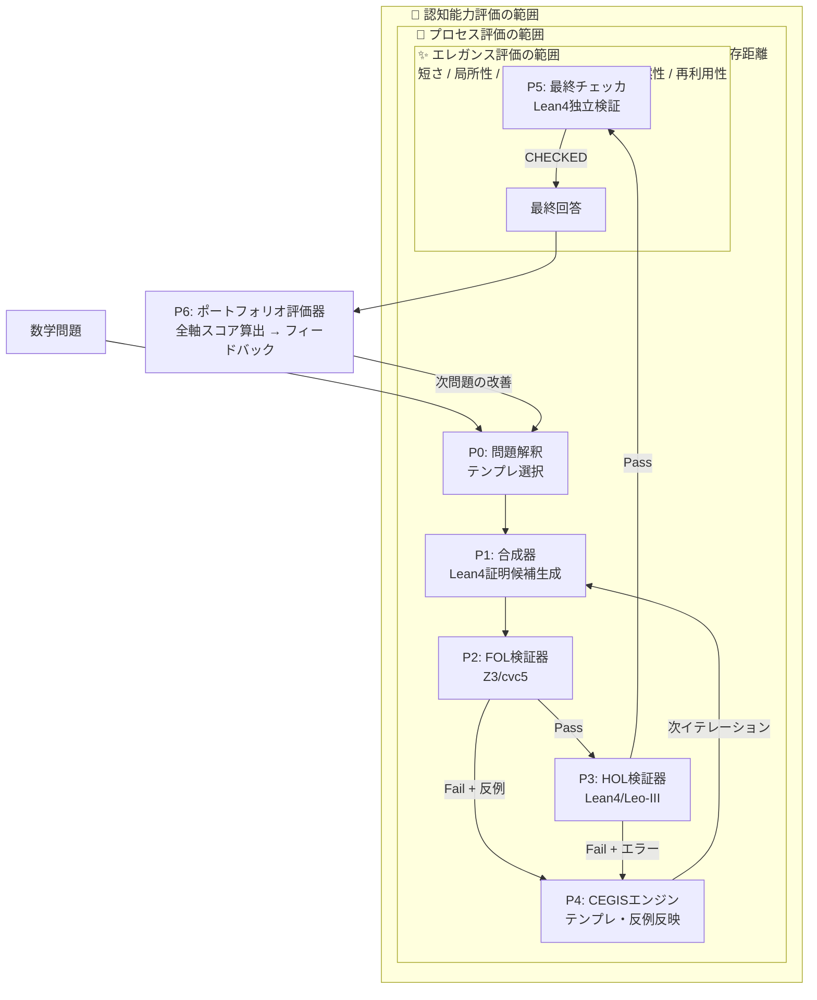
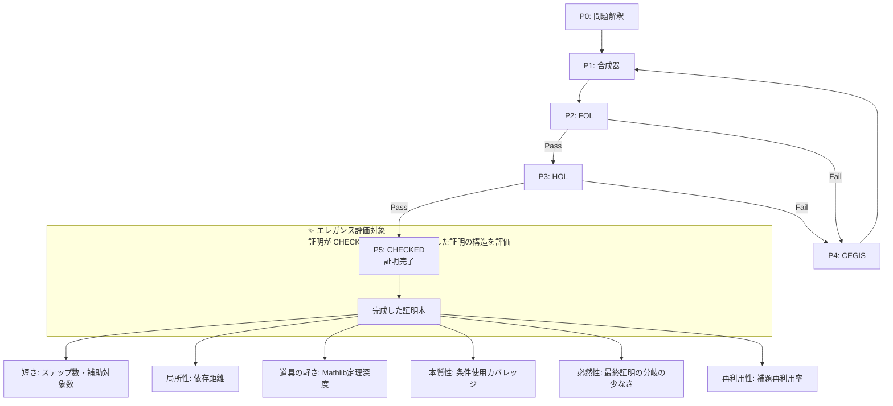
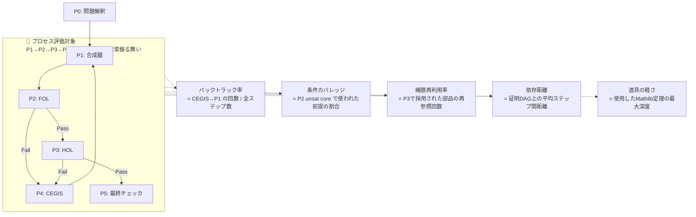
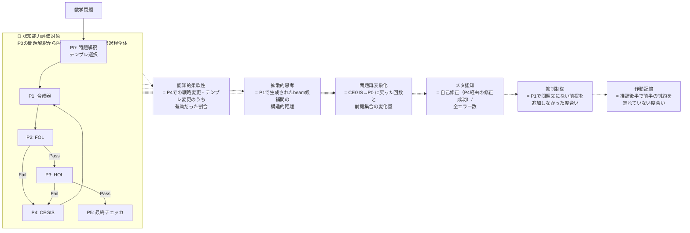
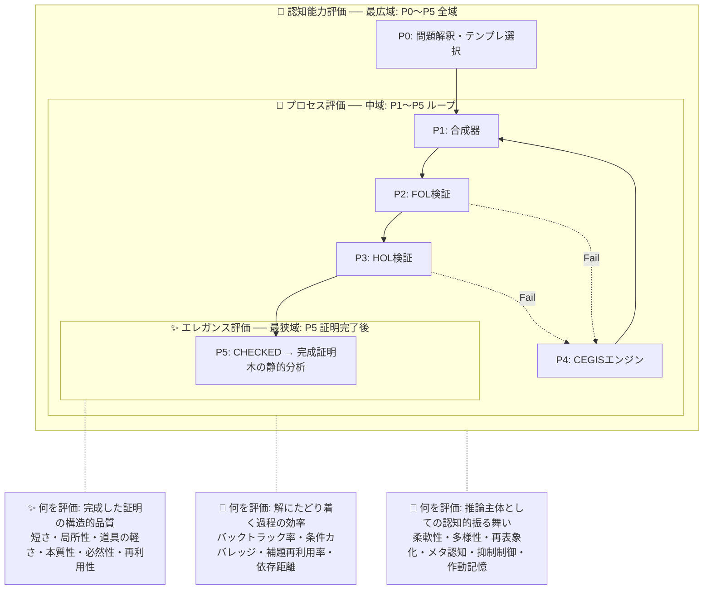
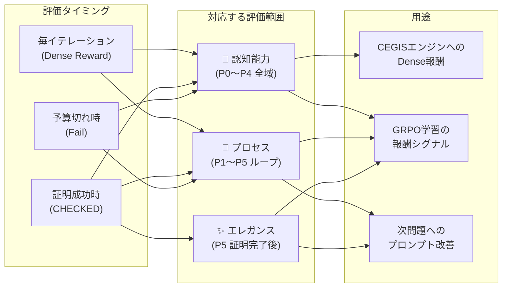
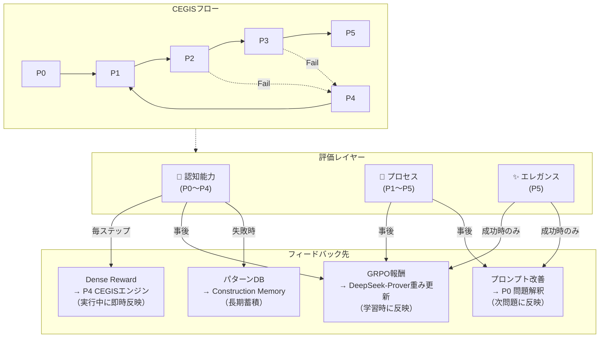

# CEGIS フローに対する評価範囲の注釈図

CEGISのプロセスの線はそのまま維持し、外側の範囲指定（subgraph）で「どこからどこまでが何の評価対象か」を示す。

## 1. 全体俯瞰: 評価範囲とCEGISフロー

## 2. 各評価軸の範囲を個別に示す

### 2-1. エレガンス評価の範囲（成功した証明の事後評価）

### 2-2. プロセス評価の範囲（CEGISループ全体の探索過程）

### 2-3. 認知能力評価の範囲（P0を含む最広域）

## 3. 範囲の入れ子関係

## 4. 評価タイミングと範囲の対応

## 5. フィードバックの流れ（範囲別）

---

## 資料準拠/提案の区別

### 資料準拠（事実）
- エレガンス6指標の定義と近似方法（エレガンスの評価方法.md）
- 認知能力指標の階層と定義（仮説推論の評価方法.md）
- CEGISのP0〜P5ポートとルール表（ソルバの出力パターン2.md）
- 3層分離の原則（正しさ → エレガンス → 説明品質）

### 提案/ドラフト
- 3つの評価範囲（エレガンス/プロセス/認知）の入れ子構造の定義
- 各評価範囲がCEGISフローのどこからどこまでを対象とするかの設計
- 範囲別のフィードバック先の振り分け
- 上記全てのMermaid図
