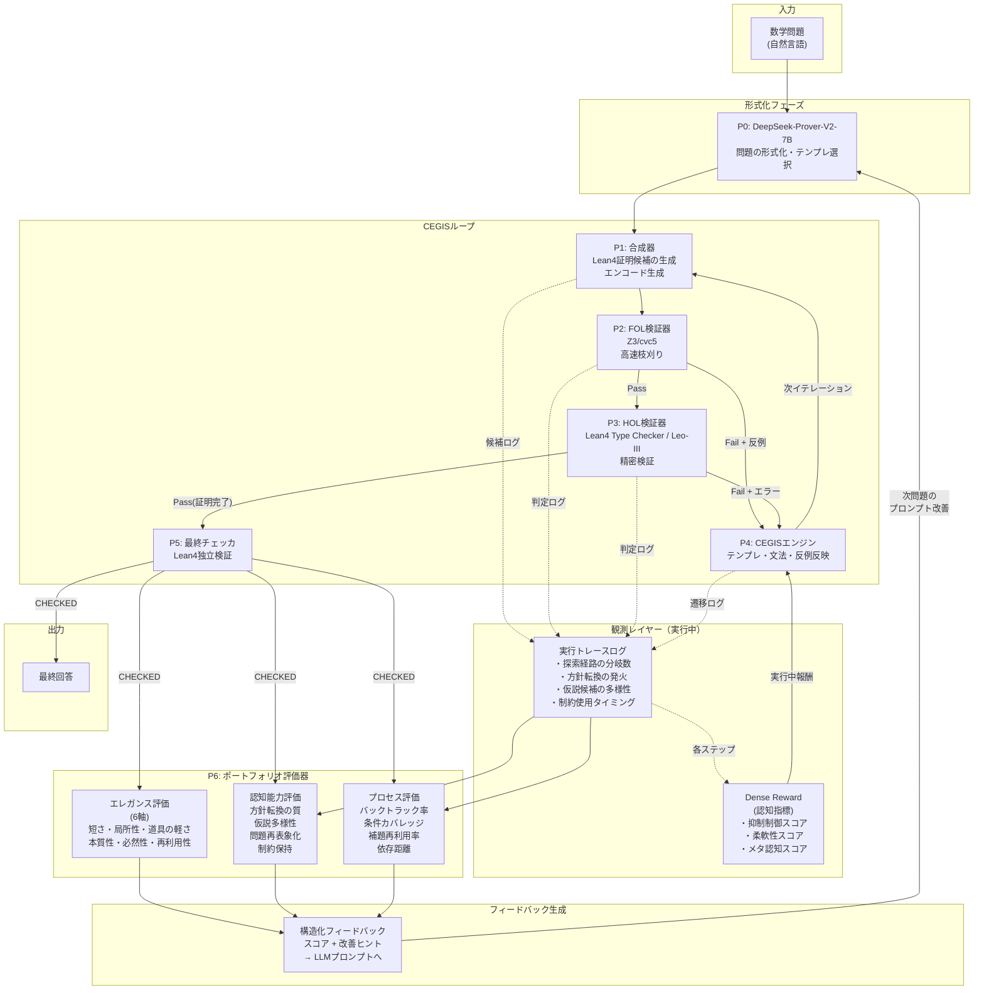
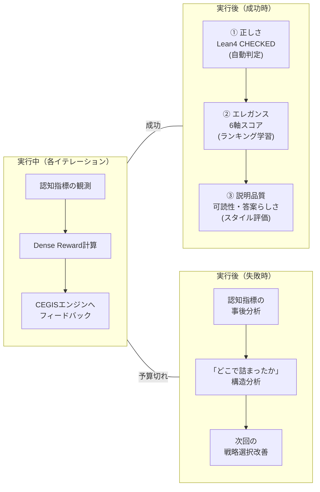
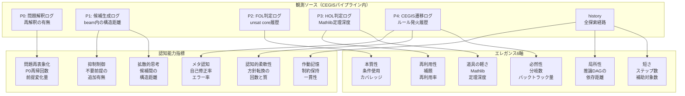
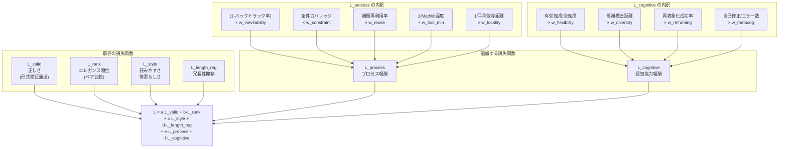
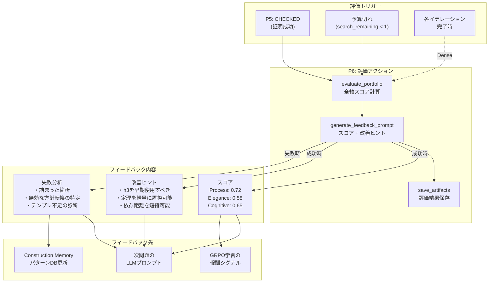
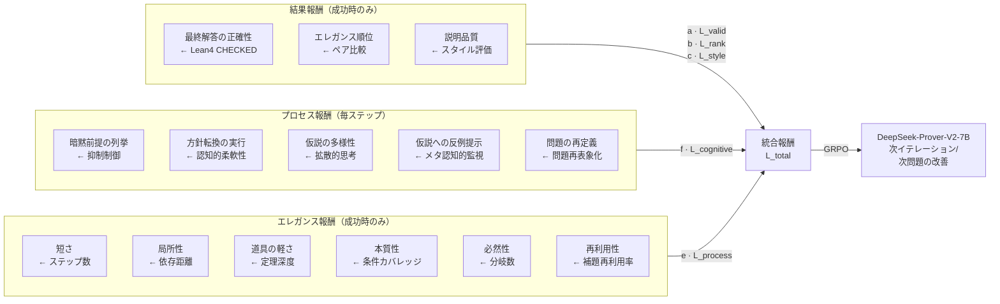

# CEGIS + エレガンス/認知能力評価 統合アーキテクチャ

## 1. 全体フロー（評価レイヤー統合版）

## 2. 評価タイミングと3層分離

## 3. 観測項目と観測箇所の対応

## 4. 損失関数の構造

## 5. ルール表への統合（P6 Portfolio Evaluator）

## 6. 報酬シグナルの種類と対応

---

## 資料準拠/提案の区別

### 資料準拠（事実）
- エレガンス6指標の定義と近似方法（エレガンスの評価方法.md）
- 認知能力の階層と報酬シグナル候補（仮説推論の評価方法.md）
- 損失関数 `L = a*L_valid + b*L_rank + c*L_style + d*L_length_reg`
- 3層分離の原則（正しさ → エレガンス → 説明品質）
- CEGISのP0〜P5ポートとルール表（ソルバの出力パターン2.md）

### 提案/ドラフト
- P6（Portfolio Evaluator）の新設
- L_process / L_cognitive の損失関数追加
- 観測項目8種と観測箇所の対応設計
- Dense Reward（実行中報酬）の仕組み
- フィードバックフォーマットの具体形
- 上記全てのMermaid図

### 未整備
- 各重みのチューニング方法
- ペア比較データの収集パイプライン
- ドメイン別評価器（幾何 vs 整数論）の分離反映方法
- 推論DAGをCEGIS historyから再構成する具体手順
