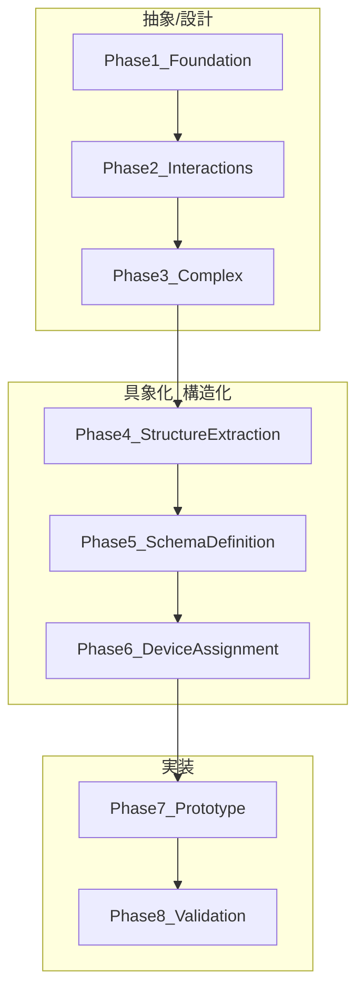
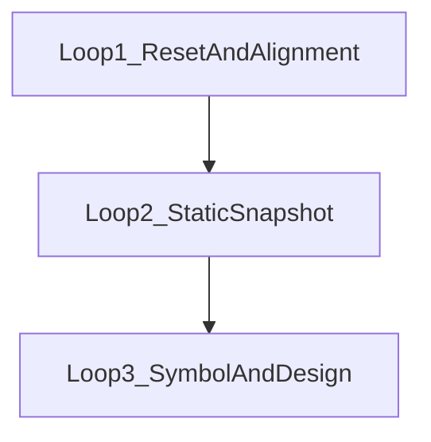

# 開発ワークフロー（Development Workflow）

## 目的

本ドキュメントは、開発ワークフロー（Phase/Loop）を把握することを目的としています。

---

## この資料の読み方（区分ルール）

本資料は、既存資料と混同しないため、記述を次の3区分で明示します。

- **資料準拠（事実）**: 参照元ファイルに記載されている事実のみを要約
- **未整備**: 必要と示唆されるが、リポジトリ上で実体・実行状況が確認できないもの
- **提案/ドラフト**: 将来フェーズ案、または採否/実行が確定していない案

---

## 1. ワークフローの全体像（資料準拠 + 提案/ドラフトの混在を明示）

本リポジトリには、ワークフローを表す資料が複数あり、**「Phase 1〜8」** と **「Loop 1〜3（v1移行プロセス）」** が併存しています。ここでは混在を明示し、根拠を分けて記述します。

### 1.1 Phase 1〜3（資料準拠）

**資料準拠（事実）**:

- Phase 1〜3 のワークフローキューが存在します（Step数: Phase1=24, Phase2=27, Phase3=27）。
- 参照元: `Agent_workspace/Agent_maneger/data/Agent_Workflow_Queue/v1_phase1.txt`, `v1_phase2.txt`, `v1_phase3.txt`

### 1.2 Phase 4〜8（提案/ドラフト）

**提案/ドラフト**:

- Phase 4〜8 は「後続フェーズの提案」として記載されています。
- 参照元: `Agent_workspace/Agent_maneger/data/Agent_Workflow_Queue/phase3以降のphase.txt`

### 1.3 Loop 1〜3（資料準拠：文書上の「決定事項」を含む）

**資料準拠（事実）**:

- `Agent_workspace/Task_Management/03_Completed/completed_init_v1_alignment.txt` は「開発プロセスの3ループ構造（Loop 1〜3）」を記載し、文書内に「決定事項」として「Loop 1へ移行」および「旧来タスクを `04_Archive/v1_alignment_20260111` へ移動」と記載しています。

**未整備**:

- 同文書の完了条件に含まれる `docs/Version1_Architecture.md` は、リポジトリ内で実体が確認できません（検索結果0件）。

---

## 2. フロー図

### 2.1 Phase 1〜8（Phase4以降は提案/ドラフト）

### 2.2 Loop 1〜3（v1移行プロセス）

---

## 3. Phase 1〜3（資料準拠）

### 3.1 Phase一覧（Phase1〜3は資料準拠、Phase4以降は後述で区分）

| Phase | 名称 | 区分 | 主な目的 | 参照元 |
|:---:|:---|:---|:---|:---|
| 1 | Foundation | 資料準拠 | 単一領域の処理をスナップショット化するワークフロー | `v1_phase1.txt` |
| 2 | Interactions | 資料準拠 | 複数領域間の影響をスナップショット化するワークフロー | `v1_phase2.txt` |
| 3 | Complex & Exception | 資料準拠 | ループ・分岐・例外を含む制御フローをスナップショット化するワークフロー | `v1_phase3.txt` |

### 3.2 Phase 1（資料準拠：手順要約）

**資料準拠（事実）**:

- `Agent_Manager` が親タスクを作成し、各専門エージェントが `01_Proposals` に提案を提出、`Agent_Manager` が `02_Active` に移動
- `Symbol_Agent` が語彙抽出・定義、`Data_Model_Agent` がスナップショット（論理式）を記述
- 完了後、`03_Completed` → `04_Archive` にアーカイブ

参照元: `Agent_workspace/Agent_maneger/data/Agent_Workflow_Queue/v1_phase1.txt`

### 3.3 Phase 2（資料準拠：手順要約）

**資料準拠（事実）**:

- Phase1成果物を参照しつつ、相互作用ユースケースを収集し、シンボル拡張→相互作用スナップショット記述→アーカイブ

参照元: `Agent_workspace/Agent_maneger/data/Agent_Workflow_Queue/v1_phase2.txt`

### 3.4 Phase 3（資料準拠：手順要約）

**資料準拠（事実）**:

- Phase1/2成果物を参照しつつ、例外・リカバリーユースケースを収集し、制御構造シンボルの定義→複合スナップショット記述→アーカイブ

参照元: `Agent_workspace/Agent_maneger/data/Agent_Workflow_Queue/v1_phase3.txt`

---

## 4. Phase 4〜8（提案/ドラフト）

**提案/ドラフト**（後続フェーズの提案）として `phase3以降のphase.txt` に記載されています。

| Phase | 名称 | 区分 | 目的 | 入力 | 出力 | 担当 |
|:---:|:---|:---|:---|:---|:---|:---|
| 4 | 構造抽出 | 提案/ドラフト | スナップショットから「名詞（データ）」と「動詞（処理）」を抽出 | Phase1〜3のスナップショット群 | クラス/変数/関数候補リスト | Data_Model_Agent + Symbol_Agent |
| 5 | スキーマ定義 | 提案/ドラフト | SwiftDataの `@Model` に落とし込む | Phase4候補リスト | Swiftデータモデル `.swift` | Data_Model_Agent |
| 6 | デバイス分担設計 | 提案/ドラフト | v1方針（Local First / Watch Centric）に基づき iPhone/Watch に割当 | Phase5スキーマ + v1提案書 | デバイス分担表 | Agent_Manager + UI_Design_Agent |
| 7 | プロトタイプ実装 | 提案/ドラフト | 最小機能をSwiftコードで実装 | Phase5/6成果物 | 動作するXcodeプロジェクト | 開発者（人間） |
| 8 | 検証とフィードバック | 提案/ドラフト | 実装がスナップショットと整合しているか検証し、修正へ反映 | Phase7実装 + スナップショット | 検証レポート、修正タスク | Agent_Manager + 開発者 |

参照元: `Agent_workspace/Agent_maneger/data/Agent_Workflow_Queue/phase3以降のphase.txt`

---

## 5. Loop 1〜3（資料準拠）

**資料準拠（事実）**:

`completed_init_v1_alignment.txt` は、v1方針（Local First / Watch Centric）への移行を前提に、3ループ構造を提示しています。

| Loop | 名称 | 資料準拠の要約 |
|:---:|:---|:---|
| 1 | リセットと定義確立 | 過去資産をアーカイブし、新方針へ揃える。完了条件に `docs/Version1_Architecture.md` を含む記載あり |
| 2 | 静的スナップショット記述 | `UI_Design_Agent` と `Monitoring_State_Agent` にスナップショット記述を割当（※v1ではタイムラインUI等を実装しない旨の注意あり） |
| 3 | 記号抽出と設計 | `Symbol_Agent` が定数/変数定義、`Data_Model_Agent` が関数（遷移）定義 |

参照元: `Agent_workspace/Task_Management/03_Completed/completed_init_v1_alignment.txt`

---

## 6. 測定モード仕様とワークフローへの関係（資料準拠）

**資料準拠（事実）**:

- `monitoring_state_agent` の資料では、**v1はトグルで測定ON/OFF**、**v2以降でタイムラインUI配置**と区分されています。
  - 参照元: `Agent_workspace/monitoring_state_agent/docs/10_状態中心設計における測定の位置づけ.txt`

**資料準拠（事実）**:

- `01_測定状態の定義と管理.txt` には、測定モードを「予定オブジェクト」として扱う記述や、タイムライン表示に関する記述が含まれます（ただしv1/v2どちらの実装対象かは当該ファイル単体では混在して見えるため、この資料では断定しません）。
  - 参照元: `Agent_workspace/monitoring_state_agent/docs/01_測定状態の定義と管理.txt`

---

## 参照元資料

- `docs/readme/readme構成案.txt`
- `Agent_workspace/Agent_maneger/data/Agent_Workflow_Queue/v1_phase1.txt`
- `Agent_workspace/Agent_maneger/data/Agent_Workflow_Queue/v1_phase2.txt`
- `Agent_workspace/Agent_maneger/data/Agent_Workflow_Queue/v1_phase3.txt`
- `Agent_workspace/Agent_maneger/data/Agent_Workflow_Queue/phase3以降のphase.txt`
- `Agent_workspace/Task_Management/README.md`
- `Agent_workspace/Task_Management/03_Completed/completed_init_v1_alignment.txt`
- `Agent_workspace/data_model_agent/業務/業務リスト.txt`
- `Agent_workspace/data_model_agent/業務/01_静的スナップショットの記述.txt`
- `Agent_workspace/monitoring_state_agent/docs/10_状態中心設計における測定の位置づけ.txt`
- `Agent_workspace/monitoring_state_agent/docs/01_測定状態の定義と管理.txt`
